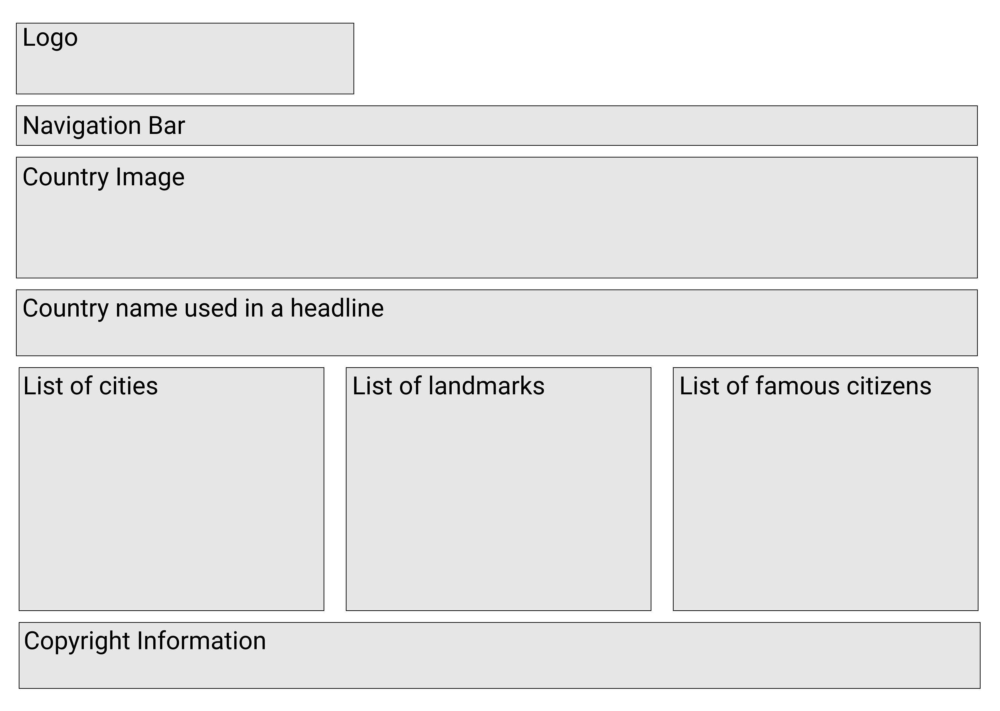

(Hello, World Narrow Penninsula Group Project Website)

# Narrow Penninsula Travel Company

Narrow Penninsula provides expert travel advice to 3 exclusive & exotic locations.

1. JAPAN 
1. NEPAL
1. JAMAICA

Our website is designed to give you a flavor of the reasons why people love to travel to these three beautiful and very different countries. 

<!-- TABLE OF CONTENTS -->
## Table of Contents

## Requirements

1. You must use semantic HTML tags
1. You must use CSS imports
1. You must use good CSS naming conventions, prefereably the BEM format
1. You must use Flexbox
1. You have one of your teammates approve a pull request before your branch is merged into `master`.
1. You must do all work on a feature branch, never on `master`.
1. Validate your HTML. Use a tool: [Validator](https://validator.w3.org/)

## User Experience

1. Your team must decide on a consistent experience across all pages. Fonts, color scheme, layout, and structure.

## Stretch Goal
1. Using [Sharethrough](https://headlines.sharethrough.com/), analyze your headline with the country name. Make adjustments to the copy to make it more engaging.

<!-- CONTACT -->
## Contact

Charles Butterworth - [LinkedIn](www.linkedin.com/in/cbutterworth3/)

Travis Stevenson - [LinkedIn](https://www.linkedin.com/in/travis-stevenson-353ba611b/)

Benjamin Vale Schweizer - [LinkedIn](https://www.linkedin.com/in/benjamin-schweizer-08b8a6111/)

<!-- ACKNOWLEDGEMENTS -->
## Acknowledgements
* [Best-README-Template](https://github.com/othneildrew/Best-README-Template)